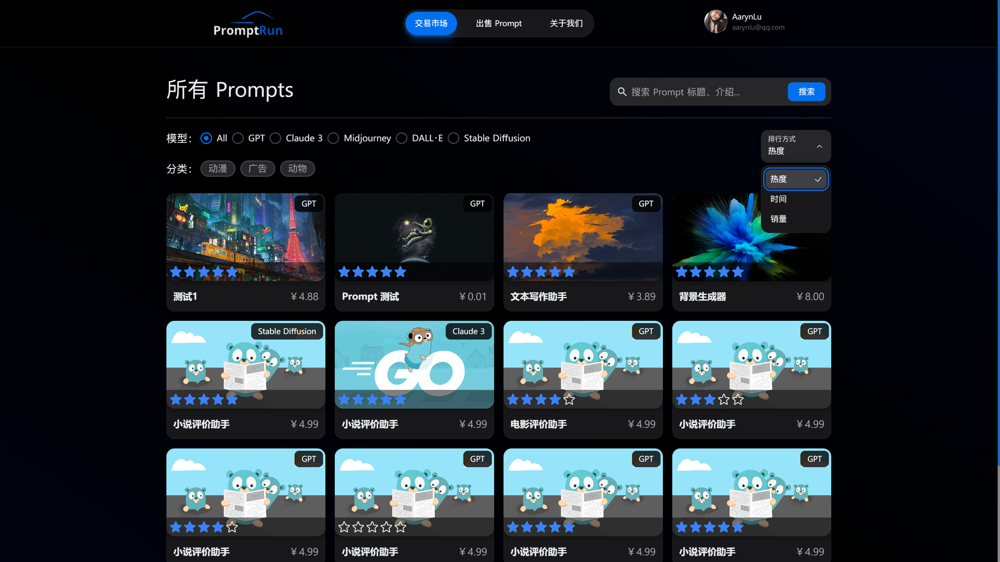

<h1 align="center">
  <br>
  
  <br>
  <a src="https://promptrun.0x3f4.run" target="_blank">PromptRun</a>
  <br>
</h1>

<p align="center">
  Make using LLMs easier, more efficient, and more in line with expectations.
</p>

<h2>Intro</h2>

<p>An AIGC (Artificial Intelligence Generated Content) prompt trading platform. Here, you can buy and sell high-quality prompts to provide inspiration and guidance for your creative, writing, and other AI-generated content tasks.</p>

<h2>Getting Started</h2>

<h3>Running Locally</h3>

<p>First, install dependency and run the development server:</p>

```sh
npm install
npm run dev
```

Open http://localhost:3000 with your browser to see the result.

<h3>Using Docker</h3>

<p>First, you need install Docker on your machine, then:</p>

```sh
docker build -t nextjs-docker .
docker run -p 3000:3000 nextjs-docker
```

Open http://your-server-ip:3000 with your browser to see the result.

<h2>Tech Stack</h2>

Front end tech:

- [React](https://react.dev/) - The library for web and native user interfaces
- [Next.js](https://nextjs.org/) - The React Framework for the Web
- [Tailwind CSS](https://tailwindcss.com/) - Rapidly build modern websites without ever leaving your HTML.
- [NextUI](https://nextui.org/) - Make beautiful websites regardless of your design experience.
- [Material-Taiwind UI](https://www.material-tailwind.com/) - The Tailwind CSS Components Library For Coding 10x Faster.
- [Flowbite UI](https://flowbite.com/) - Build websites even faster with components on top of Tailwind CSS.
- [Recharts](https://recharts.org/en-US/) - A composable charting library built on React components.
- [Sonner](https://sonner.emilkowal.ski/) - An opinionated toast component for React.
- [Zustand](https://awesomedevin.github.io/zustand-vue/en/) - A more Lightweight and Convenient state management.

Back-end tech:

- [Golang](https://go.dev/) - Build simple, secure, scalable systems with Go.
- [Gin](https://gin-gonic.com/) - The fastest full-featured web framework for Go. Crystal clear.
- [Gorm](https://gorm.io/) - The fantastic ORM library for Golang.
- [MySQL](https://www.mysql.com/) - MySQL is the world’s most popular open source database.
- [Redis](https://redis.io/) - Redis is an in-memory data store used by millions of developers as a cache.
- [Kafka](https://kafka.apache.org/) - Apache Kafka is an open-source distributed event streaming platform.
- [Corn](https://github.com/robfig/cron) - A cron library for go.

> Back-end project: https://github.com/AruNi-01/promptrun-api

<h2>Preview</h2>





<h2>License</h2>

MIT License © 2024 [AarynLu](https://github.com/aruni-01)


